# SkillBridge Connect — Supabase Database Architecture & Migrations

**Product:** AI-Powered Skill Intelligence & Academia–Industry Collaboration Platform  
**Tagline:** *Assess. Improve. Prove. Connect.*

---

## 1. Overview & Data Architecture

SkillBridge Connect Phase 2 establishes a normalized, scalable, and secure PostgreSQL database layer powered by Supabase. The database is organized into 39 core entities centered around the 4 platform personas: **Student**, **Industry**, **Academician**, and **Institution**.

```mermaid
erDiagram
    PROFILES ||--o| STUDENT_PROFILES : "extends (student)"
    PROFILES ||--o| INDUSTRY_PROFILES : "extends (industry)"
    PROFILES ||--o| ACADEMICIAN_PROFILES : "extends (academician)"
    PROFILES ||--o| INSTITUTION_PROFILES : "extends (institution)"
    PROFILES ||--o| USER_SETTINGS : "manages"

    INSTITUTIONS ||--o{ DEPARTMENTS : "contains"
    STUDENT_PROFILES }o--|| INSTITUTIONS : "belongs to"
    STUDENT_PROFILES }o--|| DEPARTMENTS : "enrolled in"
    STUDENT_PROFILES }o--|| CAREER_TARGETS : "targets"

    CAREER_TARGETS ||--o{ CAREER_TARGET_SKILLS : "defines requirements"
    SKILLS ||--o{ CAREER_TARGET_SKILLS : "required by"
    
    PROFILES ||--o{ STUDENT_SKILLS : "student has"
    SKILLS ||--o{ STUDENT_SKILLS : "tracked in"

    PROFILES ||--o{ SKILL_SCORES : "student scores"
    PROFILES ||--o{ SKILL_GAPS : "student gaps"
    PROFILES ||--o{ SKILL_EVIDENCE : "student evidence"
    PROFILES ||--o{ VERIFICATION_RECORDS : "verified in passport"
    PROFILES ||--o{ PROJECTS : "student builds"
    PROFILES ||--o{ CERTIFICATIONS : "student earns"

    ASSESSMENTS ||--o{ ASSESSMENT_QUESTIONS : "contains"
    ASSESSMENT_QUESTIONS ||--o{ ASSESSMENT_OPTIONS : "has options"
    PROFILES ||--o{ ASSESSMENT_ATTEMPTS : "takes"
    ASSESSMENT_ATTEMPTS ||--o{ ASSESSMENT_ANSWERS : "answers"

    PROFILES ||--o{ OPPORTUNITIES : "industry publishes"
    OPPORTUNITIES ||--o{ OPPORTUNITY_SKILLS : "requires"
    OPPORTUNITIES ||--o{ OPPORTUNITY_MATCHES : "matched to student"
    OPPORTUNITIES ||--o{ APPLICATIONS : "receives"
    APPLICATIONS ||--o{ APPLICATION_STATUS_HISTORY : "tracks timeline"

    INSTITUTIONS ||--o{ INSTITUTION_ANALYTICS : "tracks metrics"
    INSTITUTIONS ||--o{ INTERVENTIONS : "deploys"
    ACADEMICIANS ||--o{ WORKSHOPS : "conducts"
    PROFILES ||--o{ MENTORSHIPS : "participates in"
```



---

## 2. Core Entities (39 Tables)

| Category | Table Name | Purpose |
| :--- | :--- | :--- |
| **Auth & Profiles** | `profiles` | Central table linked to Supabase Auth (`auth.users`) |
| | `user_settings` | Notification, privacy, and accessibility preferences |
| | `student_profiles` | Education, graduation year, target career, and onboarding status |
| | `industry_profiles` | Organization name, industry type, size, website, and location |
| | `academician_profiles` | Institution, department, designation, and teaching area |
| | `institution_profiles` | Institution identity, accreditation, and campus details |
| **Institutions** | `institutions` | Universities, colleges, and polytechnics |
| | `departments` | Academic departments (Computer Science, Data Science, etc.) |
| **Careers & Skills** | `career_targets` | Target roles (Backend Developer, Frontend Developer, etc.) |
| | `skills` | Master skill library (Node.js, PostgreSQL, REST APIs, etc.) |
| | `career_target_skills` | Required threshold levels per career (e.g. Node.js 80 for Backend) |
| | `student_skills` | Student self-declared, current, and verified levels |
| **Assessments** | `assessments` | Knowledge and practical assessments |
| | `assessment_questions` | Question pool with difficulty and point values |
| | `assessment_options` | Options with answer protection for tests |
| | `assessment_attempts` | Student test sessions and recorded scores |
| | `assessment_answers` | Granular response tracking per question |
| **Skill Intelligence** | `documents` | Metadata for uploaded evidence and certificates |
| | `skill_scores` | Historical evaluation log from tests, practicals, and evidence |
| | `skill_gaps` | Computed gap score and priority (Critical, Needs Improvement, Ready) |
| | `skill_evidence` | Projects, code repos, and credentials submitted for validation |
| | `verification_records` | Skill Passport audit trail for verified capabilities |
| | `projects` | Portfolio projects submitted by students |
| | `project_skills` | Link table mapping projects to verified skills |
| | `certifications` | Professional certificates earned by students |
| **Improvement** | `improvement_plans` | Structured remediation plans for skill gaps |
| | `improvement_activities` | 4-step sequence: Learn → Practice → Challenge → Reassess |
| | `reassessments` | Historical progression tracking (e.g. 45 → 67 → 81) |
| | `progress_history` | Immutable time-series data for 6-month growth charts |
| | `ai_recommendations` | Storage for skill nudges and targeted learning plans |
| **Opportunities** | `opportunities` | Internships, jobs, mentorships, and training programs |
| | `opportunity_skills` | Relational skill requirements with minimum thresholds |
| | `opportunity_eligibility` | Structured graduation year and department criteria |
| | `opportunity_matches` | Opportunity-specific match percentage and explanation |
| | `applications` | Unique student applications to opportunities |
| | `application_status_history` | Immutable state progression (Applied → Shortlisted → Interview) |
| **Academic & Intel** | `mentorships` | 1-on-1 mentorship pairings between students and faculty/industry |
| | `workshops` | Capacity-managed skill remediation workshops |
| | `interventions` | Institutional cohort-level gap remediation programs |
| | `institution_analytics` | Time-series metrics for department and university dashboards |
| | `industry_skill_demand` | Market hiring trends and demand percentages |

---

## 3. Row Level Security (RLS) Policy Architecture

Every table is protected with granular PostgreSQL Row Level Security:
- **Public Data**: Career definitions, skill catalog, published opportunities, institutions, and departments are publicly readable.
- **Student Isolation**: Students can only access and modify their own profile, skills, test attempts, projects, certifications, and applications.
- **Industry Isolation**: Companies can create and edit their own opportunities and view applications/matched candidates submitted for their roles.
- **Academician & Institution Isolation**: Academicians and institution admins can only view analytics and student profiles belonging to their institution/department.
- **Test Integrity**: Correct answers in `assessment_options` are protected from client-side tampering during active test taking.

---

## 4. Setup & Running Migrations

### Prerequisites
1. Create a Supabase project at [https://supabase.com](https://supabase.com).
2. Retrieve your project URL and public Anon Key from Project Settings > API.

### Environment Configuration
Copy `.env.example` to `.env.local`:
```bash
cp .env.example .env.local
```
Update `.env.local` with your credentials:
```env
NEXT_PUBLIC_SUPABASE_URL=https://your-project.supabase.co
NEXT_PUBLIC_SUPABASE_ANON_KEY=your-anon-key-here
```

### Applying Migrations via Supabase CLI
```bash
supabase link --project-ref your-project-ref
supabase db push
supabase db seed
```

### Applying Migrations via Supabase Dashboard SQL Editor
If using the Supabase Web UI, run the scripts in order:
1. `supabase/migrations/01_extensions_and_enums.sql`
2. `supabase/migrations/02_institutions_and_departments.sql`
3. `supabase/migrations/03_core_profiles_and_roles.sql`
4. `supabase/migrations/04_careers_and_skills.sql`
5. `supabase/migrations/05_assessments.sql`
6. `supabase/migrations/06_skill_intelligence_and_evidence.sql`
7. `supabase/migrations/07_improvement_and_progression.sql`
8. `supabase/migrations/08_opportunities_and_applications.sql`
9. `supabase/migrations/09_academic_and_institution_intelligence.sql`
10. `supabase/migrations/10_indexes.sql`
11. `supabase/migrations/11_triggers.sql`
12. `supabase/migrations/12_row_level_security.sql`
13. `supabase/seed.sql`
